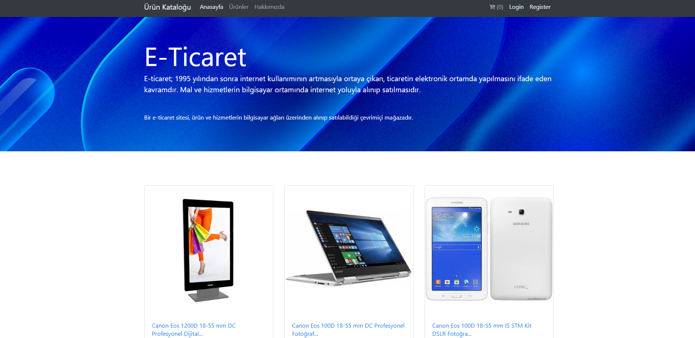
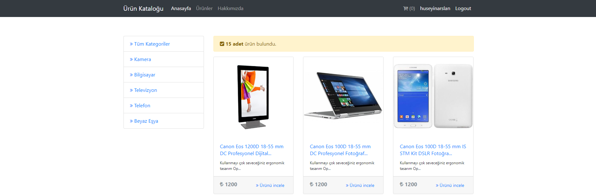
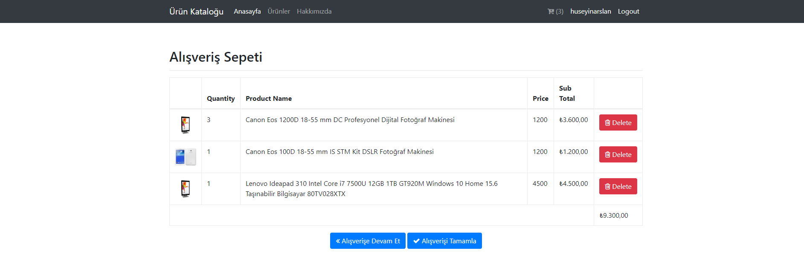
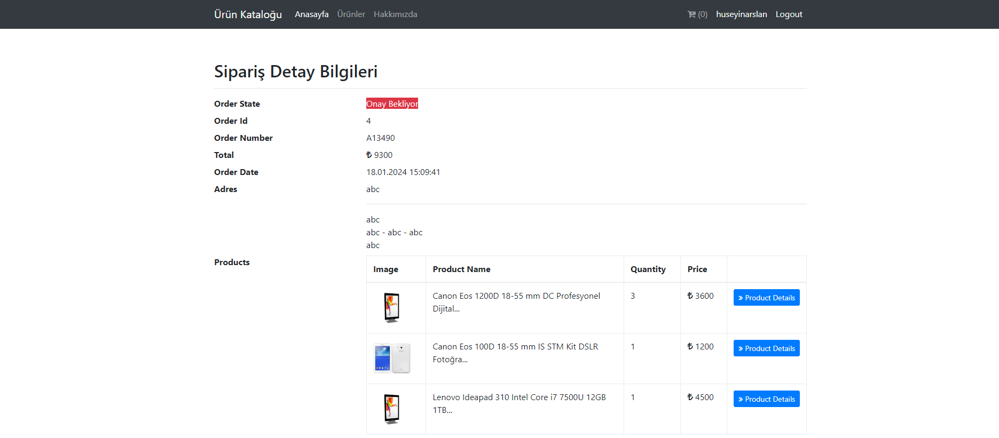

# ASP.NET E-Ticaret Sitesi Projesi
C# programlama dili ve ASP.NET platformunda Entity Framework aracılığıyla ORM tekniği kullanılan, MVC tasarım deseniyle inşa edilen bir e-ticaret sitesi prototipi:
Bu sitede kullanıcılar üyelik oluşturabiliyor, üyelik
oluşturduktan sonra ürünleri inceleyip sipariş verebiliyor,
diledikleri ürünü sepete ekleme veya sepetten çıkarma işlemini 
yapabiliyor, toplam sipariş tutarını görüntüleyebiliyor, verdikleri 
siparişi takip edebiliyor.

# ASP.NET E-Commerce Site Project
An e-commerce site prototype built with MVC design pattern, using C# programming language and ORM technique via Entity Framework on ASP.NET platform:
On this site, users can create memberships and
After creating, you can review the products and order them,
add or remove any product they want from the cart
can do so, view the total order amount,
can track the order.

